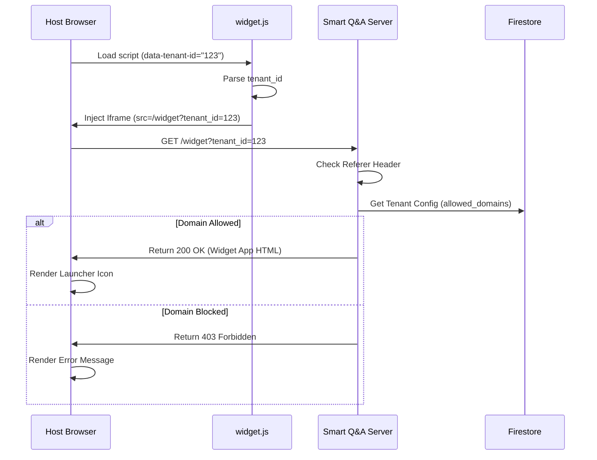
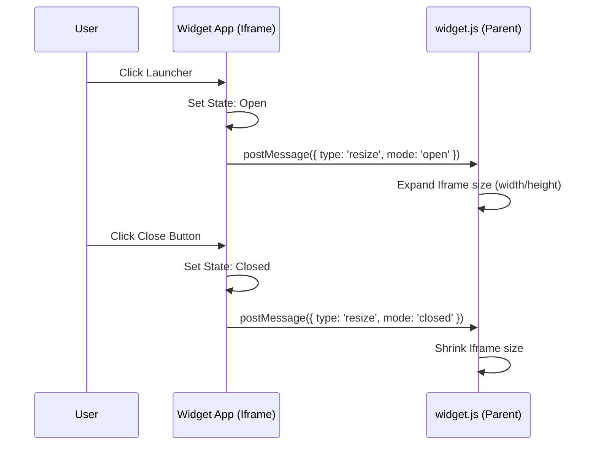
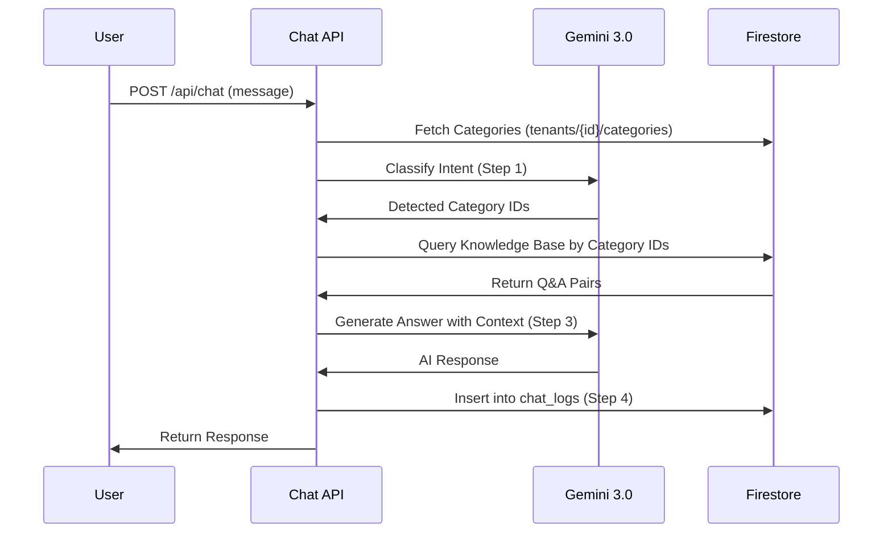

# Technical Design Document: Widget Delivery

---

**目的**: 実装者間の解釈のずれを防ぎ、実装の一貫性を確保するために十分な詳細を提供する。

**アプローチ**:

- 実装の意思決定に直接影響する重要なセクションを含める
- 機能の複雑さに応じて詳細レベルを調整する
- 長い散文よりも図や表を使用する

---

## Overview

この機能は、安全で埋め込み可能なチャットウィジェットシステムを実装します。クライアント管理者が 1 行の JavaScript をコピーするだけで、自社の Web サイトに「Smart Q&A」チャットボットを簡単に追加できるようにします。

**ユーザー**:

- **クライアント管理者**: ウィジェットスクリプトを埋め込む。
- **エンドユーザー**: クライアントサイト上でチャットウィジェットと対話する。
- **システム**: リクエストを検証し、テナント固有のコンテンツを配信する。

**インパクト**: 新しいパブリックエントリーポイント（`widget.js` + Iframe）と、データ分離およびドメイン認証を保証する安全な配信パイプラインを導入します。

### Goals

- シンプルな JS スニペットによる、堅牢でスタイルが分離されたチャットウィジェットの配信。
- ドメインベースの厳格な認証（Referer チェック）の強制。
- エンドユーザーへのシームレスなチャット体験（開く/閉じる/チャット）の実現。
- `postMessage`を介した動的なリサイズ対応。

### Non-Goals

- テナントごとのウィジェット CSS カスタマイズ（フェーズ 1 では共通 UI）。
- 高度な分析ダッシュボード（チャットログは保存されるが、可視化は別機能）。

## Requirements Traceability

| Requirement | Summary                                       | Components             | Interfaces             | Flows            |
| ----------- | --------------------------------------------- | ---------------------- | ---------------------- | ---------------- |
| **1.1**     | `widget.js`を公開ホストする                   | Widget Loader Endpoint | HTTP (Static/Dynamic)  | -                |
| **1.2**     | スクリプト設定から`tenant_id`を読み取る       | Widget Loader Script   | DOM Attribute          | Boot Flow        |
| **1.3**     | Iframe コンテナを作成する                     | Widget Loader Script   | DOM Manipulation       | Boot Flow        |
| **1.4**     | `tenant_id`付きでウィジェットをリクエストする | Widget Loader Script   | HTTP Request           | Boot Flow        |
| **2.1**     | `tenant_id`の存在を検証する                   | Widget UI Route        | Firestore Query        | Validation Flow  |
| **2.2**     | Referer/Origin を検証する                     | Widget UI Route        | HTTP Header Check      | Validation Flow  |
| **2.3**     | 未許可ドメインをブロックする                  | Widget UI Route        | HTTP 403 Response      | Validation Flow  |
| **2.4**     | ウィジェットコンテンツを配信する              | Widget UI Route        | HTTP 200 HTML          | Validation Flow  |
| **3.1**     | ランチャーアイコンを表示する                  | Widget UI App          | UI Component           | -                |
| **3.2**     | チャットウィンドウを開く                      | Widget UI App          | UI Event / PostMessage | Interaction Flow |
| **3.3**     | 閉じるボタンを表示する                        | Widget UI App          | UI Component           | -                |
| **3.4**     | チャットウィンドウを閉じる                    | Widget UI App          | UI Event / PostMessage | Interaction Flow |
| **4.1**     | 共通チャットインターフェース                  | Widget UI App          | UI Component           | -                |
| **4.2**     | `tenant_id`付きでメッセージを送信する         | Chat API               | API Request            | Chat Flow        |
| **4.3**     | ローディング表示を行う                        | Widget UI App          | UI State               | Chat Flow        |
| **4.4**     | AI 回答を表示する                             | Widget UI App          | UI State               | Chat Flow        |
| **4.5**     | スタイル分離                                  | Iframe Container       | HTML/CSS               | -                |

## Architecture

### Architecture Pattern & Boundary Map

```mermaid
graph TB
    subgraph Client Site [Client Browser / Host Page]
        HostDOM[Host Page DOM]
        Loader[widget.js (Loader Script)]
        Iframe[Widget Iframe]
    end

    subgraph SmartQA System [Smart Q&A Server]
        Nitro[Nitro Server / API]
        Firestore[(Firestore DB)]
    end

    HostDOM -- Loads --> Loader
    Loader -- Injects --> Iframe
    Loader -- Resizes via postMessage --> Iframe
    Iframe -- "GET /widget?tenant_id=..." --> Nitro
    Iframe -- "POST /api/chat" --> Nitro
    Nitro -- Validates Referer --> Firestore
    Nitro -- Queries Knowledge --> Firestore
```

**Architecture Integration**:

- **Pattern**: **Iframe-based Micro-frontend**. ウィジェットは Iframe 内で動作する自己完結型の Nuxt ページであり、軽量な Vanilla JS ローダーによって制御されます。
- **Boundaries**:
  - **Loader Script**: ホストページとの統合（DOM 注入、リサイズ）を担当。
  - **Widget App**: すべての UI とチャットロジックを担当（Iframe 内で隔離）。
  - **Server**: 検証（Referer）とビジネスロジック（RAG）を担当。

### Technology Stack

| Layer                 | Choice / Version | Role in Feature        | Notes                                                              |
| --------------------- | ---------------- | ---------------------- | ------------------------------------------------------------------ |
| **Frontend (Loader)** | Vanilla JS (ES6) | 起動 & Iframe 管理     | 依存関係なし、超軽量（<5KB）。                                     |
| **Frontend (Widget)** | Nuxt 4 (Vue 3)   | チャット UI & ロジック | Iframe 内で動作。メインアプリの UI ライブラリ（Nuxt UI）を再利用。 |
| **Backend**           | Nuxt Nitro       | 検証 & API             | `widget.js`と Iframe HTML を配信。                                 |
| **Data**              | Firestore        | 設定 & ナレッジ保存    | `allowed_domains`とチャットログを保存。                            |

## System Flows

### Widget Boot & Validation Flow



### Open/Close Interaction Flow (Resizing)



### Chat RAG Pipeline Flow



## Components and Interfaces

| Component                  | Domain/Layer | Intent                        | Req Coverage              | Key Dependencies (P0/P1)        | Contracts |
| -------------------------- | ------------ | ----------------------------- | ------------------------- | ------------------------------- | --------- |
| **Widget Loader Endpoint** | Backend/API  | ローダースクリプトを配信      | 1.1                       | -                               | API       |
| **Widget Loader Script**   | Frontend/Lib | Iframe 起動、リサイズ処理     | 1.2, 1.3, 1.4             | Host DOM (P0)                   | Event     |
| **Widget UI Route**        | Backend/Page | ウィジェット HTML 配信 + 検証 | 2.1 - 2.4                 | Firestore (P0)                  | API       |
| **Widget App (Client)**    | Frontend/UI  | チャット UI、状態、API 通信   | 3.1 - 3.4, 4.1, 4.3 - 4.5 | Chat API (P0)                   | State     |
| **Chat API**               | Backend/API  | チャット & RAG ロジック処理   | 4.2                       | Gemini API (P0), Firestore (P0) | API       |

### Backend / API

#### Widget Loader Endpoint (`/api/widget.js` or static file)

- **Intent**: Vanilla JS ローダーを配信する。
- **Implementation Note**: `public/`内の静的ファイルでも可能だが、設定（API の URL など）を注入したい場合は動的な Nitro ルートにする。フェーズ 1 では静的ファイル`public/widget.js`で十分だが、環境変数注入（Base URL 等）を考慮して生成方式を採用する。
- **Decision**: **Nitro Server Route** (`/widget.js`) を使用して環境変数注入を可能にする。

#### Widget UI Route (`/widget`)

- **Intent**: ウィジェットコンテンツ用の Nuxt ページを配信し、検証を実行する。
- **Requirements**: 2.1, 2.2, 2.3, 2.4
- **Contracts**:
  - **API Contract**:
    - **Endpoint**: `GET /widget`
    - **Query Params**: `tenant_id` (string, required)
    - **Headers**: `Referer` (checked)
    - **Response**: HTML (200) or Error (403)

#### Chat API (`/api/chat`)

- **Intent**: ユーザーメッセージを処理し、`ai-logic.md` で定義された 2 段階の AI 処理（カテゴリ特定 -> RAG 回答生成）を実行する。
- **Requirements**: 4.2
- **Contracts**:
  - **API Contract**:
    - **Endpoint**: `POST /api/chat`
    - **Body**: `{ tenant_id: string, message: string, history: Message[] }`
    - **Response**: `{ response: string, detected_category_ids: string[] }`
- **Internal Logic (AI Pipeline)**:
  1.  **Step 1: Category Identification**:
      - `tenants/{id}/categories` からカテゴリ一覧を取得。
      - Gemini (thinking_level: minimal) を使用して、ユーザーの質問がどのカテゴリに属するかを分類する。
  2.  **Step 2: Context Retrieval**:
      - 特定されたカテゴリ ID に紐づく `tenants/{id}/knowledge_base` ドキュメントを取得する。
      - 取得した Q&A ペアを **JSON 配列形式**（例: `[{ "q": "...", "a": "..." }]`）で連結してコンテキストを構築する（AI が構造を理解しやすくするため）。
  3.  **Step 3: Answer Generation**:
      - Gemini (thinking_level: low) を使用して、コンテキストのみに基づいた回答を生成する（ハルシネーション抑制）。
  4.  **Step 4: Logging**:
      - `chat_logs` コレクションに、質問、回答、特定されたカテゴリ、タイムスタンプを保存する。

### AI Prompts Management

プロンプト構築ロジックは `app/server/utils/prompts.ts` に集約し、API ハンドラから分離して管理する。

- **Classification Prompt**: ユーザーの質問とカテゴリ一覧（名前・説明）を受け取り、分類指示を構築する。
- **RAG Answer Prompt**: ユーザーの質問と検索されたナレッジ（JSON 形式）を受け取り、回答生成指示を構築する。

### Frontend / Library

#### Widget Loader Script (`widget.js`)

- **Intent**: Iframe を注入し管理する。
- **Requirements**: 1.2, 1.3, 1.4
- **Responsibilities**:
  - `document.currentScript`属性から`tenant_id`を読み取る。
  - 正しい初期スタイル（固定配置、右下）で`<iframe>`を作成する。
  - Iframe からの`message`イベントをリッスンしてリサイズする（Open vs Closed 状態）。
- **Event Contract (PostMessage)**:
  - **Inbound (from Iframe)**:
    - `{ type: 'smart-qa:resize', mode: 'open' | 'closed' }`
  - **Outbound**: なし（初期段階）。

#### Widget App (Client)

- **Intent**: Iframe 内で実行される Vue アプリケーション。
- **Requirements**: 3.x, 4.x
- **Components**:
  - `WidgetLayout`: ランチャーとチャットビューの切り替えを処理。
  - `LauncherButton`: トグルボタン。
  - `ChatWindow`: メッセージリストと入力欄。
- **State Management**:
  - `isOpen`: boolean.
  - `messages`: Array.
  - `isLoading`: boolean.

## Data Models

### Domain Model (Updates)

- **Tenant**: `allowed_domains` を使用してアクセス制御を行う。
- **Categories**: `tenants/{id}/categories`。AI による意図分類の選択肢として使用（`name`, `description`）。
- **Knowledge Base**: `tenants/{id}/knowledge_base`。`category_ids` フィールドを持ち、カテゴリ判定結果に基づいて動的にフィルタリングされる Q&A データ。
- **Chat Logs**: `chat_logs`。`detected_category_ids` を含めて会話履歴を保存する。

## Error Handling

### Error Strategy

- **Validation Failure**: `Referer`が一致しない場合、403 を返す。Loader Script（親）は必ずしもエラーを知る由はない（Iframe 内でエラーページがロードされる）。
- **Graceful Failure**: テナントが無効またはドメインがブロックされている場合、Iframe 内で丁寧な「アクセス拒否」または「設定エラー」メッセージを表示する。

## Testing Strategy

- **Integration Tests**:
  - 有効/無効な`Referer`ヘッダーで`GET /widget`をシミュレート。
  - 403 ロジックを検証。
- **E2E Tests**:
  - Playwright/Cypress を使用。
  - テストページに`widget.js`を注入。
  - Iframe の出現を確認。
  - ランチャーをクリック -> Iframe の拡大を確認（PostMessage チェック）。
  - メッセージ送信 -> API 呼び出しを確認。

## Security Considerations

- **Referer Validation**: 主要な防御策。`Referer`は非ブラウザ（curl 等）では偽装可能だが、標準的なユーザー/ブラウザが対象であるため有効。
- **CSP**: ウィジェットページには、特定のドメインによるフレーム化を許可する Content Security Policy を含めるべきである（動的 CSP が可能な場合）、またはアプリレベルのチェックに依存する場合は一般的なフレーム化を許可する。
- **Rate Limiting**: 悪用防止のため、IP 単位で`/api/chat`に標準的なレート制限を適用する。
